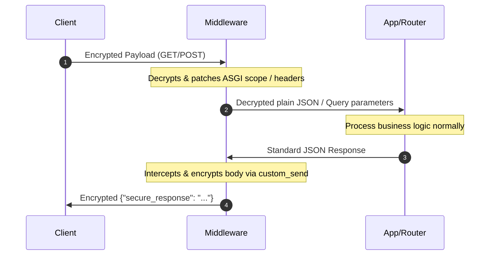

# MLE Core

A professional, zero-configuration Message Level Encryption (MLE) engine for Python. It provides project-agnostic utility functions to encrypt and decrypt Nested JWTs (JWE + JWS), and a generic, drop-in transparent middleware for FastAPI.

## Features
* **Zero Dependencies on Frameworks**: Can be used in FastAPI, Flask, Django, or pure Python scripts.
* **Stateless**: Purely mathematical. It does not touch your database or file system.
* **Nested JWT Flow**:
  * **Decrypts Client Requests**: Unpacks JWE (with Server Private Key) -> Verifies JWS (with Client Public Key).
  * **Encrypts Server Responses**: Signs JWS (with Server Private Key) -> Encrypts JWE (with Client Public Key).
* **Transparent ASGI Middleware**: Decrypts incoming request payloads/query params and encrypts outgoing responses transparently.

## Installation

```bash
pip install git+https://github.com/SrihariVattem-Dev/mle_core-.git
```

## Quick Start

### 1. Setup Keys
The library automatically looks for `MLE_SERVER_PRIVATE_KEY` and `MLE_SERVER_PUBLIC_KEY` in your environment. If not found, it checks the `keys/` folder or **generates new ones automatically**.

### 2. Manual Cryptography Usage

```python
import mle_core

# --- Communication with Frontend ---
encrypted_token = mle_core.encrypt_for_client(
    data={"message": "Hello World"},
    client_public_key=USER_PUBLIC_KEY
)

original_data = mle_core.decrypt_from_client(
    token=ENCRYPTED_TOKEN_FROM_CLIENT,
    client_public_key=USER_PUBLIC_KEY
)

# --- Internal Security ---
internal_token = mle_core.encrypt_internal(data={"user_id": 123})
data = mle_core.decrypt_internal(internal_token)

# --- Handshake ---
print(mle_core.SERVER_PUBLIC_KEY)
```

---

## 🛡️ Transparent ASGI Middleware Usage

`mle_core` includes a highly performant, generic `MLEMiddleware` designed as a pure **ASGI middleware**. It operates directly on ASGI `scope`, `receive`, and `send` pipelines, avoiding framework-specific overhead and eliminating common compatibility issues (such as streaming or body-buffering bugs associated with Starlette's `BaseHTTPMiddleware`).

It uses a dynamic **Key Resolver callback** to locate each client's public key, ensuring your application remains completely decoupled from any specific database, ORM, or token implementation.

### What to write in your project's `main.py`:

```python
from fastapi import FastAPI, Request
from mle_core import MLEMiddleware
# (Import your own project dependencies below)
from database import SessionLocal
from models import User
from utils.jwt_handler import validate_server_access_token

app = FastAPI()

# 1. Define your project's specific public key resolver
async def resolve_client_public_key(request: Request) -> str | None:
    """
    Decodes the Bearer token, checks authentication, and returns the 
    user's stored public key. If this returns None, the middleware 
    transparently bypasses encryption for this request (e.g., login/register).
    """
    auth_header = request.headers.get("authorization", "")
    if not auth_header.startswith("Bearer "):
        return None
        
    token = auth_header.split(" ", 1)[1]
    try:
        # Decode your access token (e.g., standard HS256 JWT)
        payload = validate_server_access_token(token)
        email = payload.get("email")
        if not email:
            return None
            
        # Open your DB session, query your user, and return their client_public_key
        db = SessionLocal()
        try:
            user = db.query(User).filter(User.email == email).first()
            return user.client_public_key if user else None
        finally:
            db.close()
    except Exception:
        return None

# 2. Add the MLEMiddleware and inject the callback
# Since it is a standard ASGI middleware, you can register it directly
app.add_middleware(MLEMiddleware, key_resolver=resolve_client_public_key)
```

---

### ⚙️ How the ASGI Pipeline Works Under the Hood

The `MLEMiddleware` intercepts raw ASGI communication channels to provide completely transparent payload translation:



1. **GET Requests:** Automatically detects `?encrypted_data=ey...` in query parameters. If present, it decrypts the parameter, reconstructs the plain query string dictionary, and patches the ASGI `scope["query_string"]` dynamically. Your routes read standard, unencrypted query arguments!
2. **POST Requests:** Intercepts and streams the raw HTTP request body chunks from the ASGI `receive` channel. It decrypts the standard `{"encrypted_data": "ey..."}` wrapper, rewrites the raw ASGI headers to correct the `Content-Length`, and supplies a custom `receive` callback downstream. Your FastAPI routers receive standard, native Pydantic objects as if no encryption was ever applied!
3. **Response Interception:** Employs a wrapped `custom_send` channel to intercept outgoing ASGI response events. It aggregates all chunked response data, encrypts the final JSON payload using the client's public key, packages it into a secure `{"secure_response": "ey..."}` envelope, corrects the response `Content-Length` header in `http.response.start`, and forwards it to the client.

---

### 🚨 Robust Error Handling & Logging

To prevent malformed requests or cryptographic issues from causing unhandled exceptions in the application:
* **Automatic Logging:** If a POST decryption failure occurs (due to mismatched keys, expired tokens, or malformed data), the middleware catches the exception, prints the traceback to stdout, and logs the full stack trace inside `logs/error.log` for easy administration and auditing.
* **Graceful HTTP 400 Bad Request:** Instead of crashing or returning an unhandled 500 error, it returns a clean ASGI JSON payload to the client:
  ```json
  {
    "status": "error",
    "detail": "Decryption failed: <error_reason>"
  }
  ```

---

## Environment Variables
- `MLE_SERVER_PRIVATE_KEY`: Your Server's RSA Private Key (PEM format).
- `MLE_SERVER_PUBLIC_KEY`: Your Server's RSA Public Key (PEM format).
- `MLE_ENABLED`: Toggle MLE feature globally (`True`/`False`). Defaults to `True`.
